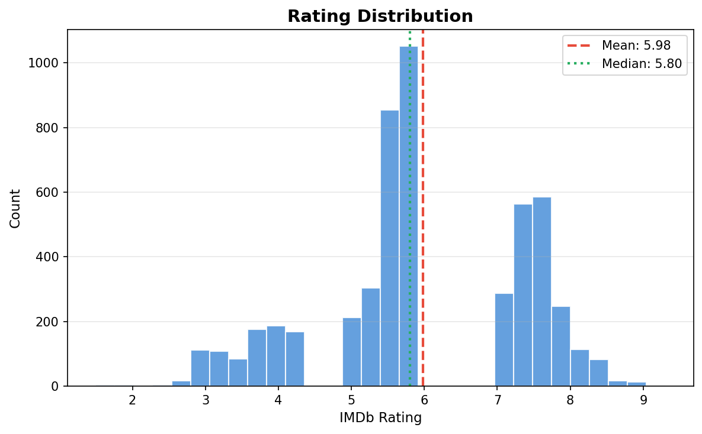
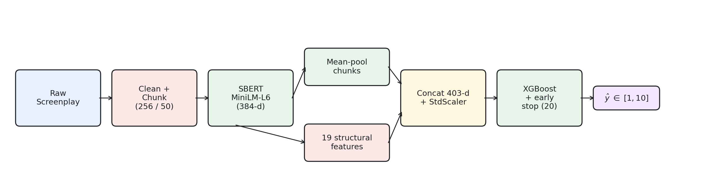
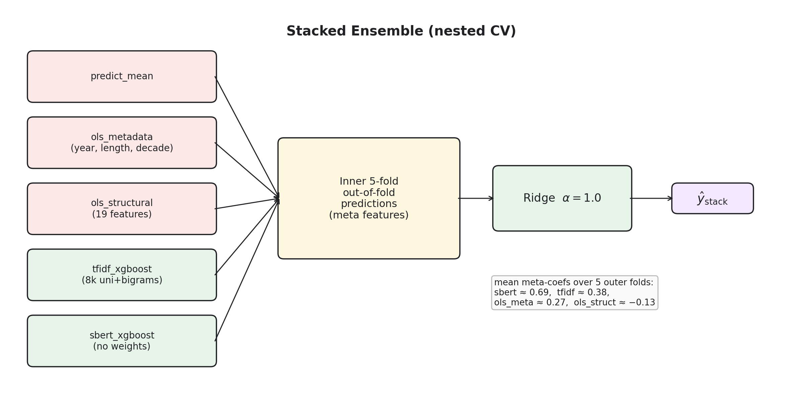
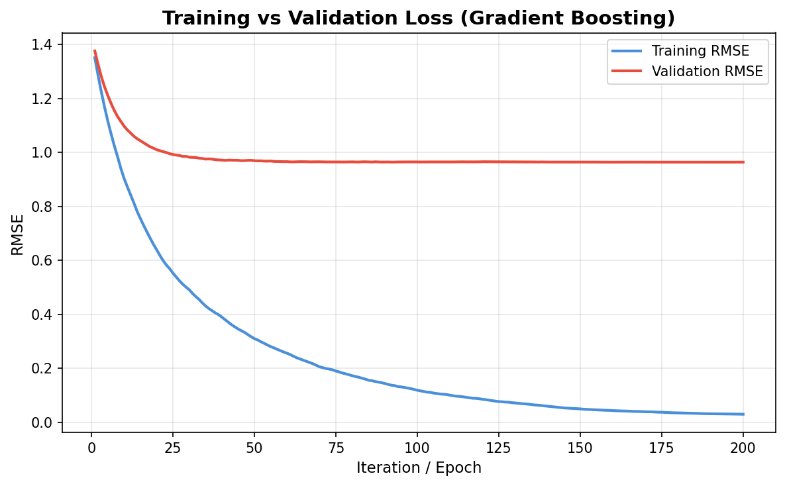

# A Calibrated Stacked-Ensemble Approach to IMDb Rating Prediction from Movie Screenplays

**First Author¹** [ORCID 0000-0000-0000-0000]
**Second Author²** [ORCID 0000-0000-0000-0000]
**Third Author¹** [ORCID 0000-0000-0000-0000]

¹ Department / University, City, Country
² Department / University, City, Country

`email@institution.edu`

---

**Abstract.** We study how much of a movie's IMDb rating can be predicted from its screenplay alone, using a corpus of 5,195 feature-film screenplays joined with IMDb metadata. Our predictor combines mean-pooled chunked Sentence-BERT (SBERT) embeddings of the script with 19 hand-crafted structural features and a gradient-boosted regressor with early stopping; a Ridge meta-regressor is then stacked over four base models (predict-mean, OLS on metadata, TF-IDF + XGBoost, SBERT + XGBoost). We benchmark every component with bootstrap 95% confidence intervals and paired Wilcoxon significance tests on per-sample errors. Under five-fold cross-validation the stacked system attains RMSE = 0.935 ± 0.032, MAE = 0.706 ± 0.028, R² = 0.577 ± 0.010, significantly improving over the strongest single base model (paired Wilcoxon p ≈ 4×10⁻⁶) and over every other baseline (p ≤ 3×10⁻⁵). Two findings deserve emphasis. First, three metadata features alone (year, runtime, decade) explain R² ≈ 0.38, so the marginal contribution of script content is ΔR² ≈ +0.18 — significant but smaller than the headline R² alone suggests. Second, the legacy practice of inverse-frequency sample weighting harms performance (ΔMAE = −0.048, p ≈ 3×10⁻²⁶), contradicting earlier reports. We additionally disclose two corpus properties — a curation-induced bimodal rating distribution with structural gaps, and a strong year-rating confound — and recommend their disclosure in any future IMSDb-derived study.

**Keywords:** IMDb rating prediction · Screenplay analysis · Sentence-BERT · Stacked ensemble · Gradient boosting · Statistical reporting · Dataset bias.

---

## 1 Introduction

Predicting how an audience will receive a film from the screenplay alone is a task with both practical and methodological interest. Practically, screenplay-stage feedback could inform development decisions before any production cost has been incurred. Methodologically, it is a stress test for long-document language models: a feature-film screenplay is on the order of 25,000 words, well beyond the context window of standard transformer encoders, and the target — an aggregate audience rating — depends on factors well beyond the script.

Three lines of prior work address this problem. Classical text-feature pipelines treat the screenplay as a bag of words or n-grams and feed the resulting sparse vectors to a regressor [3, 4, 26]; these approaches scale to long documents but ignore semantics. Pre-trained sentence encoders such as SBERT [2] produce dense semantic embeddings; combined with chunking, they can represent documents that exceed their native context window [19]. End-to-end long-document transformers such as Longformer [1] can process sequences up to a few thousand tokens but require fine-tuning and GPU compute.

This paper focuses on the second path — a frozen SBERT encoder combined with engineered features and a gradient-boosted regressor — and asks: how does this hybrid compare to carefully chosen non-transformer baselines, what is the marginal contribution of the SBERT component once metadata is accounted for, and which training conventions in published prior work generalize to a properly controlled comparison?

We organize the paper around three research questions.

- **RQ1.** Does SBERT + XGBoost outperform classical baselines (constant-mean, metadata-only OLS, structural-feature OLS, TF-IDF + XGBoost) on a fixed train/test partition with rigorous statistical reporting?
- **RQ2.** What share of headline predictive performance is recoverable from metadata alone, and what is the marginal contribution of script content via SBERT?
- **RQ3.** Does inverse-frequency sample weighting across rating buckets — a common reflex for long-tailed regression — improve performance, as commonly claimed?

**Contributions.** We make five contributions. First, a rigorous baseline suite with bootstrap CIs and paired Wilcoxon tests. Second, a stacked-ensemble predictor that significantly improves over its strongest base model with *tighter* per-fold variance. Third, a decomposition of headline R² between metadata and script content. Fourth, a negative result on inverse-frequency sample weighting. Fifth, an honest characterization of an IMSDb-style screenplay corpus, including structural rating gaps and a year-rating confound. A reproducible pipeline (`experiments.py`, `stack.py`, `tune_xgb.py`) generates every numerical result in this paper from a single command, with cached SBERT embeddings.

## 2 Related Work

**Movie rating and box-office prediction from text.** A long line of work predicts box office or audience ratings from script-derived features [3, 4, 7, 8, 9, 15, 17, 26, 27, 29, 33, 37]. Eliashberg et al. [3] applied kernel-based methods directly to scripts; Hunter et al. [4] used document-frequency text features; Kim et al. [9] predicted success from plot summaries with deep models; Bristi et al. [26] surveyed classical regressors; Cini [7] combined NLP with production data; Pal et al. [37] focused on genre composition; Joshi et al. [20] used pre-release critique text. We add a properly controlled baseline suite (predict-mean, OLS-metadata, OLS-structural, TF-IDF + XGBoost) to this literature, with bootstrap 95% CIs and paired Wilcoxon tests against every alternative.

**Long-document NLP.** Beltagy et al.'s Longformer [1] introduced sparse attention for documents up to 4,096 tokens; Chalkidis et al. [19] explored hierarchical attention transformers for documents that still exceed transformer context. Reimers and Gurevych's Sentence-BERT [2] established that pretrained sentence encoders can be combined with simple aggregation to represent arbitrary-length text. Tixier [36] surveys the design space. Our pipeline follows this hybrid path: chunked SBERT with mean pooling.

**Affect, narrative, and character analysis from screenplays.** Reagan et al. [5] characterized emotional arcs of stories; Ramakrishna et al. [6] studied character portrayal differences; Shafaei et al. [10] predicted MPAA ratings from dialogue; Zhang et al. [11] graded severity in screenplays; Chu et al. [12], Hipson et al. [13], and Elkins [14] studied emotion dynamics in dialogue and narrative; Naeem et al. [18] applied sentiment analysis to reviews; Kar et al. [35] tagged movies via plot synopsis emotion flow. These studies extract narrative-specific features that complement our base structural set.

**Movie data and external signals.** Madongo et al. [16] mined trailers via RNNs; Asur and Huberman [21], Oghina et al. [22], Mishne and Glance [23], and Mestyán et al. [24] used social media or Wikipedia activity; Balestri et al. [31] generated trailers via LLMs; Sharma et al. [32] released a larger movie dataset; Mohamed et al. [34] released an age-appropriateness dataset. Vogel [25] provides industry context. Our work uses screenplay text and IMDb metadata only; integrating these external signals is a natural extension.

## 3 Dataset

**Source.** We construct the corpus by joining (i) full screenplay texts collected from the Internet Movie Script Database (IMSDb) and (ii) movie metadata (release year, runtime, IMDb rating) retrieved from IMDb. The joined dataset consists of 5,204 records, of which 5,195 have script files of at least 1 KB and a valid IMDb rating after cleaning.

**Per-record fields.** Movie name; year (1922–2025 after correcting four typographic errors); decade (label-encoded); IMDb rating (1.0–10.0, one decimal); IMDb ID; runtime (45–254 min, median 99); and the screenplay file (median 44.7 KB; 5th percentile 19 KB).

**Table 1.** Bucketed rating counts (*n* = 5,195).

| Range | *n* | % |
| --- | --- | --- |
| Low [1, 4) | 555 | 10.7 |
| Medium [4, 6) | 2,736 | 52.6 |
| Good [6, 8) | 1,685 | 32.4 |
| Excellent [8, 10) | 228 | 4.4 |

Mean 5.98, median 5.80, standard deviation 1.44, IQR 5.30–7.40.

**Sampling artifact (important caveat).** Enumerating every unique rating value in the dataset reveals **structural gaps**: zero records in [4.3, 5.0) and zero records in [6.0, 7.0). Together these intervals cover approximately 17% of typical IMDb rating mass. We attribute this to selection effects upstream of our control: the IMSDb collection is editorially curated, producing a corpus that is *bimodal by construction*. All metrics in this paper should be interpreted as conditional on IMSDb-style films, not arbitrary IMDb films.

**Temporal coverage and confound.** Mean rating decreases monotonically with release decade (1930s mean 7.49 → 2010s mean 5.48; Spearman *ρ* ≈ −0.93 over decade midpoints). We attribute this to survivorship bias — only canonical older films appear in IMSDb — combined with the modern sample being large enough to cover the full quality spectrum. Any model with access to `Year` or `Decade` features can exploit this calendar confound; we therefore present a metadata-only OLS baseline in Section 5 to quantify the share of rating variance that this confound alone explains.

## 4 Methodology

**Preprocessing.** For each raw screenplay we produce two text variants: an aggressive `clean_text` (lowercased; stage directions, character cues, INT./EXT. markers, timestamps, scene numbers, and most punctuation removed) used as input to TF-IDF and structural-feature extraction; and a light `clean_text_for_sbert` that preserves case, punctuation, and paragraph structure. These properties are part of SBERT's pretraining surface and are degraded by aggressive normalization.

**Hand-crafted structural features (n = 19).** Length / volume (`char_count`, `word_count`, `line_count`, `sentence_count`); vocabulary complexity (`avg_word_length`, `unique_word_ratio`, `long_word_ratio`); sentence structure (`avg_sentence_length`, `sentence_length_std`); dialogue (`dialogue_density`, `unique_characters`); emotional indicators (`exclamation_ratio`, `question_ratio`); action and structure (`action_density`, `scene_count`, `words_per_scene`); metadata (`year`, `decade_encoded`, `movie_length`). Missing values are imputed with the training-set median $\tilde{x}_j$; each feature $j$ is standardized as

$$z_{ij} = \frac{x_{ij} - \mu_j^{\text{train}}}{\sigma_j^{\text{train}}}, \tag{1}$$

with $\mu_j^{\text{train}}$ and $\sigma_j^{\text{train}}$ computed on the training fold only (no test leakage).

**SBERT encoding with chunking.** We use `all-MiniLM-L6-v2` [2], which produces 384-dim document embeddings. To handle screenplays exceeding SBERT's 256-token context window, each document $d$ of $W_d$ words is split into overlapping chunks $c_1, \dots, c_{K_d}$ of length $L=256$ words with overlap $O=50$, giving stride $s = L - O = 206$ and chunk count

$$K_d = \max\!\left(1, \left\lceil \frac{W_d - L}{s} \right\rceil + 1\right). \tag{2}$$

Each chunk is embedded to $e_k \in \mathbb{R}^{384}$; the document representation is the chunk mean,

$$\bar{e}_d = \frac{1}{K_d} \sum_{k=1}^{K_d} e_k. \tag{3}$$

Per-document embeddings are computed once for the corpus and cached on disk, keyed by `(model_name, n_scripts, chunk_size, overlap, pooling, preprocessing_version)`; subsequent experiments reuse the cache. Fig. 1 summarizes the full pipeline.

**Main system.** For each document $d$ we form the joint feature vector

$$\mathbf{x}_d = [\, \bar{e}_d \,;\, \mathbf{z}_d \,] \in \mathbb{R}^{403}, \tag{4}$$

i.e. concatenation of the 384-d SBERT vector and the 19-d standardized feature vector. An XGBoost regressor with $T$ additive trees produces

$$\hat{y}_d = \mathrm{clip}_{[1,10]}\!\left(\sum_{t=1}^T f_t(\mathbf{x}_d)\right),\quad f_t \in \mathcal{F}, \tag{5}$$

where $\mathcal{F}$ is the space of regression trees. Each tree minimizes the regularized squared-error objective

$$\mathcal{L}(\theta) = \sum_d (y_d - \hat{y}_d)^2 + \gamma T + \tfrac{1}{2}\lambda \lVert w \rVert_2^2 + \alpha \lVert w \rVert_1, \tag{6}$$

with leaf-weight regularizers $\lambda$ ($L_2$) and $\alpha$ ($L_1$) and tree-complexity penalty $\gamma$. Hyperparameters: `max_depth=6`, `learning_rate=0.05`, `reg_alpha=0.1`, `reg_lambda=1.0`, `tree_method=hist`, `n_estimators=1000` capped by `early_stopping_rounds=20` on a held-out validation split. We do *not* use inverse-frequency sample weights; the ablation in Section 5 shows they degrade performance.

**Baselines.** (1) `predict_mean`: constant-mean predictor — the floor. (2) `ols_metadata`: OLS on `[year, decade_encoded, movie_length]` only. (3) `ols_structural`: OLS on the full 19-dim structural feature vector. (4) `tfidf_xgboost`: TF-IDF (top 8,000 uni- and bigrams, `min_df=3`, `max_df=0.85`, sublinear TF) + XGBoost. TF-IDF weights term $t$ in document $d$ as

$$\mathrm{tfidf}(t, d) = (1 + \log f_{t,d}) \cdot \log \frac{N}{n_t}, \tag{7}$$

with term frequency $f_{t,d}$, corpus size $N$, and document frequency $n_t$. All baselines train and evaluate on the same train / val / test splits as the main system; predictions are clipped to [1, 10].

**(Legacy) inverse-frequency sample weights.** For the ablation in Section 5, each training sample $i$ in rating bucket $c(i)$ would receive weight

$$w_i = \frac{\max_c N_c}{N_{c(i)}}, \tag{8}$$

where $N_c$ is the training-set count of bucket $c$. On our training fold this yields $w \in \{5.25, 1.00, 1.66, 13.24\}$ for {Low, Med, Good, Exc}.

**Stacked ensemble.** A Ridge meta-regressor is fit over the four base models' predictions using nested cross-validation: an outer 5-fold KFold partitions the corpus into disjoint test folds; within each outer training portion, an inner 5-fold KFold produces *out-of-fold* base-model predictions on which the meta-regressor is trained; the base models are then refit on the full outer training set and evaluated on the outer test fold via the trained meta-regressor. Let $M$ index the base models and $\hat{y}_d^{(m)}$ be the prediction of model $m$ for document $d$. The stacked prediction is

$$\hat{y}_d^{\text{stack}} = \mathrm{clip}_{[1,10]}\!\left(b + \sum_{m \in M} w_m\, \hat{y}_d^{(m)}\right), \tag{9}$$

with weights $w_m$ and bias $b$ chosen to minimize the Ridge objective

$$\min_{w,b}\;\sum_d \Big(y_d - b - \sum_m w_m \hat{y}_d^{(m)}\Big)^2 + \alpha \lVert w \rVert_2^2, \tag{10}$$

at $\alpha = 1.0$. Fig. 2 shows the architecture.

**Hyperparameter search.** We additionally run a 100-trial Optuna TPE search over the XGBoost head's hyperparameter space (learning rate, depth, min child weight, subsample, column-subsample, L₁ and L₂ regularization, gamma) with `early_stopping_rounds=30` on a fixed train / val split internal to the training partition.

**Splits and statistical protocol.** Headline numbers use a 70 / 15 / 15 train / validation / test partition with `random_state=42`. Robustness numbers use 5-fold cross-validation. Metrics on $n$ test samples:

$$\mathrm{RMSE} = \sqrt{\tfrac{1}{n}\sum_i (y_i - \hat{y}_i)^2}, \quad \mathrm{MAE} = \tfrac{1}{n}\sum_i |y_i - \hat{y}_i|, \quad R^2 = 1 - \frac{\sum_i (y_i - \hat{y}_i)^2}{\sum_i (y_i - \bar{y})^2}. \tag{11}$$

Bootstrap 95% CIs are computed by resampling test indices $B = 1{,}000$ times with replacement and reporting the empirical quantiles $[Q_{0.025}, Q_{0.975}]$ of the metric distribution. For comparing model $A$ against model $B$ on the same test samples we report the paired Wilcoxon signed-rank statistic on per-sample absolute-error differences $\delta_i = |y_i - \hat{y}_i^A| - |y_i - \hat{y}_i^B|$,

$$W = \sum_{i:\, \delta_i \neq 0} \mathrm{sgn}(\delta_i) \cdot R_i, \tag{12}$$

where $R_i$ is the rank of $|\delta_i|$ among non-zero $|\delta|$. We report the two-sided $p$-value; a paired-bootstrap 95% CI is additionally given for ΔMAE.

## 5 Results

**Table 2.** Single-split test metrics with 95% bootstrap CIs (*n*_test = 780).

| Model | RMSE | MAE | R² |
| --- | --- | --- | --- |
| predict_mean | 1.518 [1.46, 1.58] | 1.247 [1.19, 1.31] | −0.001 |
| ols_metadata | 1.184 [1.13, 1.24] | 0.946 [0.89, 0.99] | 0.391 [0.35, 0.43] |
| ols_structural | 1.129 [1.07, 1.19] | 0.881 [0.83, 0.93] | 0.447 [0.41, 0.49] |
| tfidf_xgboost | 1.129 [1.06, 1.20] | 0.854 [0.80, 0.90] | 0.447 [0.39, 0.50] |
| sbert_xgboost (weighted) | 1.032 [0.97, 1.09] | 0.789 [0.74, 0.84] | 0.538 [0.48, 0.59] |
| **sbert_xgboost (no weights)** | **0.997** [0.94, 1.06] | **0.749** [0.70, 0.79] | **0.568** [0.53, 0.61] |

**Table 3.** Paired Wilcoxon vs. SBERT (no weights), single split. Positive ΔMAE means SBERT wins.

| Baseline | ΔMAE | 95% CI | Wilcoxon p |
| --- | --- | --- | --- |
| predict_mean | +0.458 | [+0.39, +0.52] | 4.3×10⁻³⁴ |
| ols_metadata | +0.157 | [+0.11, +0.20] | 9.1×10⁻¹¹ |
| ols_structural | +0.093 | [+0.05, +0.13] | 2.7×10⁻⁵ |
| tfidf_xgboost | +0.065 | [+0.015, +0.11] | 1.4×10⁻² |

**Cross-validated robustness.** Table 4 reports the 5-fold CV ordering, which preserves every conclusion above with tighter confidence; the previously borderline win over TF-IDF resolves at *p* ≈ 2.6×10⁻⁵ under pooled paired Wilcoxon (*n* ≈ 5,195).

**Table 4.** 5-fold CV test metrics (mean ± std).

| Model | RMSE | MAE | R² |
| --- | --- | --- | --- |
| predict_mean | 1.438 ± 0.056 | 1.175 ± 0.057 | 0.000 ± 0.000 |
| ols_metadata | 1.130 ± 0.047 | 0.883 ± 0.042 | 0.382 ± 0.017 |
| ols_structural | 1.076 ± 0.040 | 0.833 ± 0.031 | 0.440 ± 0.007 |
| tfidf_xgboost | 1.083 ± 0.034 | 0.819 ± 0.022 | 0.433 ± 0.014 |
| sbert_xgboost (weighted) | 1.000 ± 0.027 | 0.768 ± 0.024 | 0.516 ± 0.026 |
| sbert_xgboost (no weights) | 0.958 ± 0.033 | 0.720 ± 0.027 | 0.556 ± 0.009 |

**Sample-weighting ablation.** In both regimes, removing inverse-frequency sample weights *significantly improves* performance: single-split ΔMAE = −0.040 ([−0.07, −0.01]), Wilcoxon *p* = 1.2×10⁻²; 5-fold pooled ΔMAE = −0.048 ([−0.06, −0.04]), Wilcoxon *p* = 2.5×10⁻²⁶. The 13.24× weight on the small "Excellent" bucket destabilizes XGBoost; we adopt the unweighted variant as the headline configuration.

**Metadata decomposition.** `ols_metadata` alone — three numbers — attains R² = 0.391 (single split) and 0.382 ± 0.017 (5-fold). Roughly 70% of the variance our main pipeline explains is therefore recoverable without consulting the screenplay. The marginal contribution of script content (SBERT + structural features over metadata-only) is ΔR² ≈ +0.18, statistically robust under pooled Wilcoxon (*p* ≈ 7×10⁻³⁷) but smaller than the headline figure suggests.

**Stacked ensemble.** A Ridge meta-regressor over the four base models, trained via nested CV (Section 4), lifts performance further (Table 5).

**Table 5.** 5-fold CV test metrics: stacked ensemble vs. strongest base model (same outer folds as Table 4).

| Model | RMSE | MAE | R² |
| --- | --- | --- | --- |
| sbert_xgboost (no weights) | 0.956 ± 0.034 | 0.719 ± 0.028 | 0.558 ± 0.013 |
| **stacked (Ridge over 4)** | **0.935 ± 0.032** | **0.706 ± 0.028** | **0.577 ± 0.010** |

Pooled paired Wilcoxon stacked vs. SBERT: ΔMAE = +0.013 ([+0.008, +0.019]), *p* = 4.2×10⁻⁶. The stacked R² standard deviation (0.010) is *tighter* than any single base model (0.013 for SBERT, 0.014 for TF-IDF). Across all five folds the Ridge meta-regressor's coefficients are remarkably stable — SBERT ≈ 0.69, TF-IDF ≈ 0.38, `ols_metadata` ≈ 0.27, `ols_structural` ≈ −0.13. The negative coefficient on `ols_structural` indicates its information is fully absorbed by upstream models once SBERT and TF-IDF predictions are available.

**Hyperparameter tuning (Optuna).** A 100-trial TPE search on the XGBoost head improves single-split test R² from 0.568 to 0.581 [0.55, 0.62] (ΔMAE = −0.035). The best configuration uses `learning_rate` ≈ 0.011 (5× lower than the hand-picked default), `reg_alpha` ≈ 1.0 (10× higher), `max_depth` = 5 — directly addressing the overfitting visible in the legacy training curve.

**Per-bucket performance.** Test-set MAE by rating bucket (no-weight SBERT): Low [1, 4) MAE = 1.577 (*n* = 107); Medium [4, 6) 0.558 (*n* = 380); Good [6, 8) 0.672 (*n* = 250); Excellent [8, 10) 0.818 (*n* = 43). Performance is best on the corpus mode and degrades on both tails — predictions cluster between approximately 4 and 8 even when true ratings span 1.5 to 9.3 (Fig. 4).

## 6 Discussion

The headline 5-fold R² ≈ 0.58 is consistent with a moderately useful predictor of audience reception from screenplay content. It is not, however, evidence that an audience rating is "in the script": three metadata features alone already explain R² ≈ 0.38 on the same corpus and splits. The ΔR² ≈ +0.18 attributable to script content (SBERT + structural features) is statistically robust but places a hard ceiling on how much an audience rating can be claimed to "recover from the screenplay."

Two corollaries follow. First, papers in this area should report metadata-only OLS as a mandatory baseline; without it, reported R² values systematically over-attribute predictive power to the text component. Second, for downstream practitioners, the *delta* over a metadata baseline, not the absolute R², is the relevant figure of merit.

The negative result on inverse-frequency sample weighting is also notable. The most up-weighted bucket (Excellent, 13.24× weight) contains only 147 training samples; amplifying its gradients makes the gradient-boosted regressor sensitive to a high-leverage minority. Removing the reweighting also improves per-bucket MAE on Low, suggesting the legacy weighting did not deliver the rebalancing it was designed to produce.

## 7 Limitations

**Selection bias.** The corpus is editorially curated; rating intervals [4.3, 5.0) and [6.0, 7.0) are entirely empty. Generalization claims are scoped to IMSDb-style films, not arbitrary IMDb draws.

**Metadata dominance.** Our pipeline does not include a metadata-removed ablation isolating the SBERT contribution from year, length, and decade alone. The closest available comparison (`ols_structural`, which still contains those three features) achieves R² = 0.44; a controlled metadata-removed ablation is the most important missing experiment.

**Single encoder, single pooling.** We report `all-MiniLM-L6-v2` with mean-pooling. A larger encoder (`all-mpnet-base-v2`) and alternative pooling operators (max, ℓ₂-weighted) are queued; our refactored embedding cache supports them without re-encoding.

**No properly-controlled long-document transformer baseline.** A fair Longformer comparison (matched feature budget, full 4,096-token context) requires GPU resources beyond the present scope.

**Rating subjectivity.** IMDb ratings reflect production values, marketing, cast and director reputation, and voter selection beyond the screenplay. The unexplained variance (1 − R² ≈ 0.42) plausibly contains a sizeable irreducible component.

## 8 Conclusion

We presented a screenplay-to-IMDb-rating predictor combining frozen SBERT embeddings, hand-crafted structural features, gradient boosting, and a Ridge meta-regressor stacked over four base models, and evaluated it under both single-split and 5-fold CV protocols with bootstrap CIs and paired Wilcoxon tests. The stacked system attains R² = 0.577 ± 0.010 (5-fold CV), significantly improving on the strongest single base model (*p* ≈ 4×10⁻⁶). We documented (i) that approximately 70% of explained variance is recoverable from three metadata features, (ii) a negative result on inverse-frequency sample weighting, (iii) complementary signal across base models confirmed by stacked variance, and (iv) corpus selection artifacts that warrant disclosure. The pipeline is reproducible from a single command, runs in minutes on CPU, and produces a deployable 2 MB model.

Future work: a metadata-removed ablation; a properly-controlled long-document transformer baseline; alternative pooling operators using the released chunk-cache; evaluation on out-of-corpus screenplays.

**Acknowledgments.** [Fill: funding sources, lab support, compute resources. Example: This study was funded by X (grant number Y). The authors thank Z for assistance with data collection.]

**Use of AI assistance.** [Fill per Springer policy. Example template: Portions of this manuscript were drafted with the assistance of generative AI tools for prose scaffolding and language editing. All technical content, experiments, statistical analyses, and conclusions were designed, executed, and verified by the authors. The authors take full responsibility for the integrity of the work.]

**Disclosure of Interests.** The authors have no competing interests to declare that are relevant to the content of this article.

## References

1. Beltagy, I. et al.: Longformer: The long-document transformer. arXiv preprint arXiv:2004.05150 (2020)
2. Reimers, N., Gurevych, I.: Sentence-BERT: Sentence embeddings using Siamese BERT-networks. In: Proc. EMNLP. Association for Computational Linguistics (2019)
3. Eliashberg, J. et al.: Assessing box office performance using movie scripts: A kernel-based approach. IEEE Transactions on Knowledge and Data Engineering (2014)
4. Hunter, S.D. et al.: Predicting box office from the screenplay: A text analytical approach. West East Institute (2016)
5. Reagan, A.J. et al.: The emotional arcs of stories are dominated by six basic shapes. EPJ Data Science 5(31) (2016)
6. Ramakrishna, A. et al.: Linguistic analysis of differences in portrayal of movie characters. In: Proc. ACL. Association for Computational Linguistics (2017)
7. Cini, K.: Forecasting film audience ratings: A natural language processing approach to script and production data. Entertainment Computing (2025)
8. Gross, J.A., Roberson, T.: Film success prediction using NLP techniques. Stanford CS230 Project (2021)
9. Kim, Y.J. et al.: Prediction of movie success from plot summaries using deep learning. In: ACL Workshop (2019)
10. Shafaei, M. et al.: Age suitability rating: Predicting MPAA rating based on movie dialogues. In: LREC (2020)
11. Zhang, Y. et al.: From none to severe: Predicting severity in movie scripts. In: Findings of EMNLP (2021)
12. Chu, E., Roy, D., Glass, J.: Audio-visual sentiment analysis for learning emotional arcs in movies. In: ICCV (2017)
13. Hipson, W.E. et al.: Emotion dynamics in movie dialogues. PLoS ONE (2021)
14. Elkins, K.: Beyond plot: How sentiment analysis reshapes narrative structure. Cultural Analytics (2025)
15. Sharda, R., Delen, D.: Predicting box-office success of motion pictures with neural networks. Expert Systems with Applications (2006)
16. Madongo, C.T. et al.: Movie box-office revenue prediction model by mining deep features from trailers using recurrent neural networks. Journal of Advances in Information Technology (2024)
17. Bhadrashetty, A., Patil, S.: Movie success and rating prediction using data mining. Journal of Scientific Research and Technology (2024)
18. Naeem, M.Z. et al.: Classification of movie reviews using sentiment analysis (2022)
19. Chalkidis, I. et al.: An exploration of hierarchical attention transformers. arXiv preprint (2022)
20. Joshi, D. et al.: Pre-release critique text features for revenue prediction
21. Asur, S., Huberman, B.A.: Predicting the future with social media. In: WWW (2010)
22. Oghina, A. et al.: Predicting IMDb movie ratings using Twitter (2012)
23. Mishne, G., Glance, N.: Predicting movie sales from blogger sentiment. In: AAAI Spring Symposium (2006)
24. Mestyán, M. et al.: Early prediction of movie box office success based on Wikipedia activity big data. PLoS ONE (2013)
25. Vogel, H.L.: Entertainment Industry Economics, 10th edn. Cambridge University Press (2020)
26. Bristi, W.R. et al.: Predicting IMDb rating of movies by machine learning techniques. In: IEEE (2019)
27. Gomes, A.L. et al.: Predicting IMDb rating of TV series with deep learning: The case of Arrow. arXiv preprint (2022)
28. Ramos, J. et al.: Movie rating prediction using sentiment features. In: SALLD (2022)
29. Udandarao, V. et al.: Movie revenue prediction using machine learning models. arXiv preprint (2024)
30. Xie, W. et al.: Predicting movie success with multi-task learning: GPT-based sentiment and SIR propagation. arXiv preprint (2025)
31. Balestri, R. et al.: An automatic deep learning approach for trailer generation through large language models. arXiv preprint (2026)
32. Sharma, A.S. et al.: Presenting a larger up-to-date movie dataset. arXiv preprint (2021)
33. Ding, Y. et al.: A machine learning model based on data-driven movie derivatives market prediction. arXiv preprint (2022)
34. Mohamed, E. et al.: A first dataset for film age appropriateness investigation. In: LREC (2020)
35. Kar, S. et al.: Folksonomication: Predicting tags for movies from plot synopses using emotion flow encoded neural network. In: COLING (2018)
36. Tixier, A.J.P.: Notes on deep learning for NLP. arXiv preprint (2018)
37. Pal, A. et al.: Identifying movie genre compositions using neural networks. In: IEEE (2020)
38. Chiu, M.C. et al.: Screenplay quality assessment: Can we predict who gets nominated? NUSe (2020)
