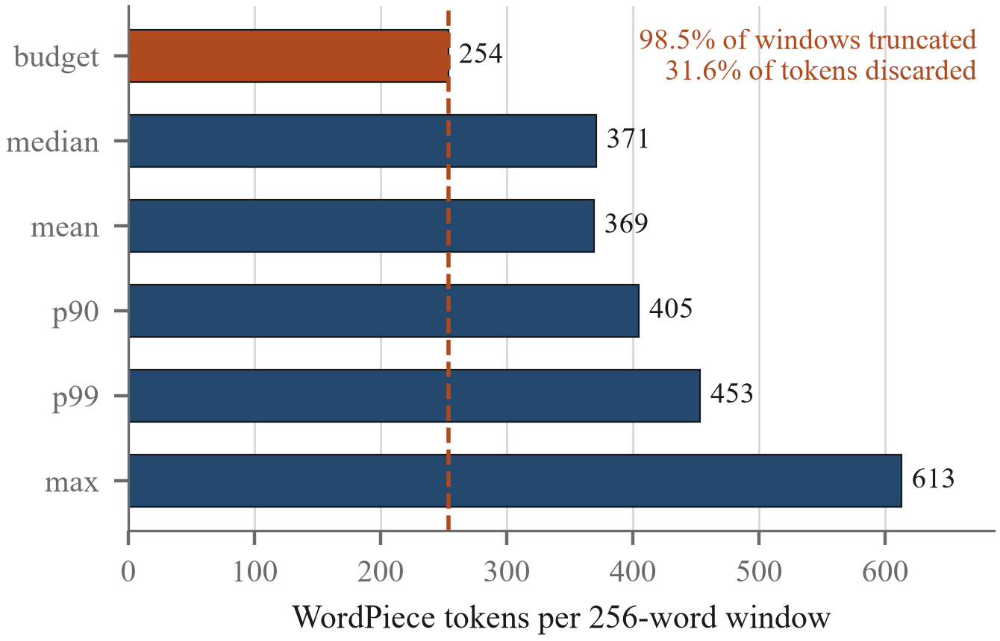
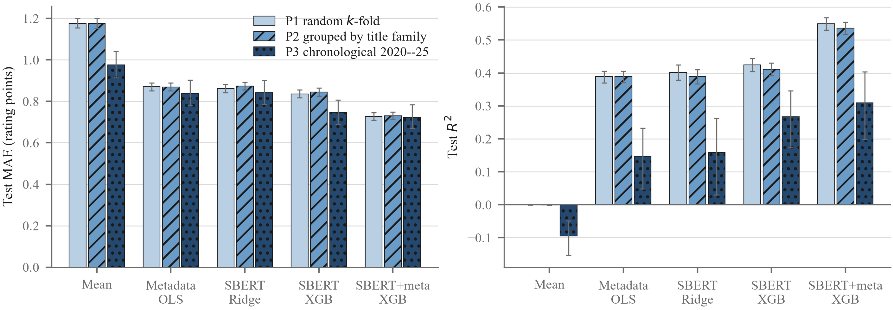
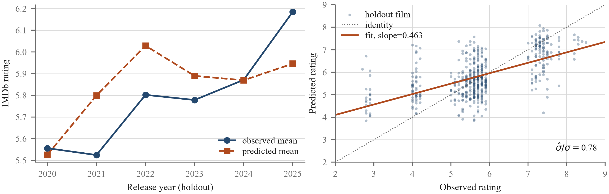
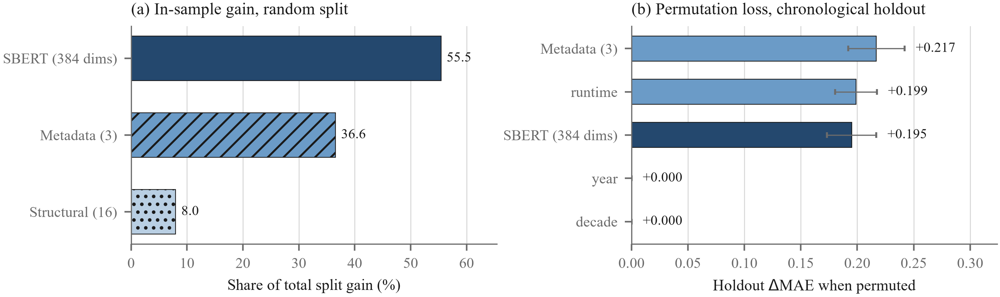

# What Survives a Strict Split? An Empirical Audit of Long-Document Screenplay Modelling for IMDb Rating Prediction

**Anonymous authors**

***Abstract**—Screenplay-to-rating regression is usually reported on a random split of an archival corpus. We argue that this number is not the number a reader wants, and we measure the gap. Working from a corpus of 5,204 IMSDb screenplays joined to IMDb metadata, we first run a record-identity audit — content SHA-256 digests, IMDb identifiers, title×year keys, and a normalised title-family key — and publish the resulting exclusion ledger, which retains 5,164 records after removing nine sub-1 KB fragments, four corrupt release years, and twenty-seven records whose positional identity in the archived embedding matrix cannot be resolved uniquely. We then quantify a defect that is invisible at the API surface: the pipeline slides a 256-*word* window over each script, but the encoder admits only 254 WordPiece *tokens*, so 98.45% of windows are cut and 31.60% of all tokens never reach the model. Finally we evaluate identical representations and learners under three partitions — random k-fold, title-family GroupKFold, and a chronological 2020–2025 holdout. Skill is strongly protocol-dependent: the best system reports R^2=0.549 [0.530, 0.567] under random folds, 0.536 [0.516, 0.554] once franchises are held together, and 0.309 [0.199, 0.404] when the test set lies in the future. Block-permutation analysis on the temporal holdout explains why. Release year and decade, which jointly supply 36.6% of in-sample split gain, contribute exactly DeltaMAE=0.000 once the test years fall outside the training range, while runtime alone (+0.199) matches the entire 384-dimensional sentence-embedding block (+0.195). Semantic embeddings survive the strict split; the calendar confound does not.*

***Index Terms**—data leakage, evaluation protocol, sentence embeddings, long-document NLP, screenplay analysis, temporal generalisation, grouped cross-validation.*


## I. Introduction

A feature-film screenplay runs to roughly 25,000 words. Sentence encoders read 256 tokens. That mismatch is the central engineering problem in screenplay modelling, and the usual answer — slide a window, embed each window, average the results — is cheap, reproducible, and widely used. What is far less often examined is whether the evaluation wrapped around that pipeline measures anything a practitioner could rely on, because an archival screenplay corpus assembled from a community repository carries two structural hazards that a shuffled train/test split will silently convert into apparent skill.

The first hazard is duplication. Community archives accumulate the same work under several file names, franchises share vocabulary and structure across installments, and remakes reuse plot and dialogue wholesale. Under a random partition, a near-copy in the training set makes its twin in the test set trivially predictable. The effect is not exotic; it is the dominant failure mode catalogued in surveys of leakage-driven irreproducibility across applied machine learning [32], and it has been documented specifically for train–test overlap in NLP benchmarks [30, 31].

The second hazard is time. Ratings in an archival corpus are collected once, at scrape time, but the films span a century, and both the selection process and the rating behaviour of the audience drift. A model given a release-year feature can recover a large share of target variance from the calendar alone, without reading a single line of dialogue. That shortcut evaporates the moment the test films are drawn from years the model never saw, which is the only setting in which a screenplay-stage predictor would actually be deployed.

Layered underneath both is a quieter defect specific to chunked long-document pipelines. Chunking is almost always specified in words; truncation always happens in subword tokens. Nobody is told when the budget is exceeded — the encoder simply drops the tail — so a configuration that reads as “256-word windows with 50-word overlap” can in practice discard a third of the corpus without emitting a single warning.

This paper is an audit, not a leaderboard entry. We take an existing SBERT-plus-gradient-boosting pipeline over 5,204 IMSDb screenplays and ask what its reported performance is actually made of. Three contributions follow.

- **C1 — A record-identity protocol and its exclusion ledger.** We define film identity through four keys — content SHA-256 digest, IMDb identifier, title×year, and a normalised title-family stem — audit all 5,204 joined records against each, and report every exclusion (Section III). The audited corpus contains no duplicate identifiers and no duplicate title×year pairs, but 80 title collisions and 164 multi-member title families that a random split would happily straddle.
- **C2 — A measurement of silent truncation.** Running the encoder's own tokeniser over the pipeline's own windows, we find that 98.45% of 256-word windows exceed the 254-token content budget and that 31.60% of WordPiece tokens are discarded before the encoder sees them, with a median window of 371 tokens against a budget of 254 (Section IV-B).
- **C3 — A three-protocol evaluation with paired inference.** Holding representation and learner fixed, we vary only the partition: random k-fold, title-family GroupKFold, and a chronological 2020–2025 holdout. We report bootstrap intervals, paired Wilcoxon signed-rank tests with matched-pairs effect sizes, and a block-permutation attribution that isolates which feature families survive temporal extrapolation (Sections V and VI).

We do not claim a new state of the art. We claim that the difference between R^2=0.549 and R^2=0.309 on the same corpus, the same features, and the same learner is the finding.


## II. Related Work


### A. Computational analysis of screenplays

Early work treated the script as a feature source for commercial forecasting. Eliashberg et al. [3] extracted genre, content, and semantic descriptors from spec scripts and fed a kernel regression to predict return on investment; Hunter et al. [4] pushed a similar text-analytic pipeline toward box-office revenue. Both established the premise this paper inherits — that a screenplay carries measurable signal about reception — and both evaluated on randomly partitioned archival collections.

A second strand reads narrative structure rather than commercial outcome. Reagan et al. [5] recovered six recurring emotional arc shapes from sentiment trajectories; Ramakrishna et al. [6] quantified linguistic differences in character portrayal; Chu et al. [9] added audiovisual channels. Downstream classification tasks built on script text include MPAA age-suitability rating [7, 25], severity prediction [8], and tag assignment from plot synopses [26]. Screenplay quality assessment in the awards-nomination framing [27] is the closest analogue to rating regression, and it shares our target's central difficulty: the label is an aggregate social judgement, only partly a function of the text.


### B. Box-office and rating forecasting

Outside the script itself, forecasting has drawn on production metadata [10], social-media volume [15, 17], Twitter signals [16], Wikipedia activity [18], trailer content [11], and review sentiment [13, 22]. IMDb rating regression from tabular and textual metadata is by now a standard applied exercise [12, 20, 23], with deep-learning variants for serial content [21] and multi-task formulations that fold sentiment and diffusion together [24]. The reported figures span a wide range, and the partitions behind them are rarely specified beyond a random seed. Vogel's industry account [19] is a useful corrective on the ceiling: theatrical outcomes are dominated by release strategy, competition, and marketing spend, none of which is legible in the script.


### C. Representations for long documents

Sentence-BERT [2] produces dense sentence-level embeddings from a Siamese objective and is the encoder we audit. Its native context is short, so document-level use requires either hierarchical attention [14], sparse attention over longer sequences [1], or chunk-and-pool aggregation. Chunk-and-pool is the pragmatic default: it needs no fine-tuning, runs on CPU, and scales linearly. Its cost is that the aggregation function is fixed rather than learned, and — as we measure in Section IV-B — that the chunk boundary is usually specified in a unit the encoder does not use. Classical n-gram TF-IDF remains a competitive lexical control on long technical text and is included here for exactly that reason.


### D. Leakage and split design in archival NLP

The methodological literature we lean on is not about films. Gorman and Bedrick [28] showed that system rankings in POS tagging reorder under alternative random splits; Søgaard et al. [29] generalised the argument and recommended split designs that stress the generalisation actually claimed. Lewis et al. [30] found that a large fraction of open-domain QA test questions have near-duplicates in training, and Elangovan et al. [31] formalised train–test overlap measurement. Kapoor and Narayanan [32] catalogue leakage taxonomies across disciplines and argue for pre-registration of the split. Temporal generalisation has its own line [33], as does documentation of corpus provenance [34, 35]. Applying these instruments to a screenplay corpus is, to our knowledge, new; the findings in Section V suggest the exercise was overdue.


## III. Corpus Integrity and Exclusion Audit


### A. Source and join

The corpus joins full screenplay texts scraped from the Internet Movie Script Database (IMSDb) to IMDb metadata on a per-film basis. Each of the 5,204 joined records carries a title, release year, decade bin, IMDb identifier, runtime in minutes, an IMDb rating on the 1.0–10.0 scale at one-decimal resolution, and a path to the script file. Ratings have mean 5.98, median 5.80, and standard deviation 1.44; runtimes span 45–254 minutes with median 99.


### B. Four identity keys

Deduplication is only as good as the notion of identity behind it, so we audit four keys of decreasing strictness.

*Content digest.* For a script file with byte content b, the key is SHA256(b), rendered as a 64-character hexadecimal digest. Two records collide if and only if their files are byte-identical, which catches the re-upload-under-a-new-name case that no metadata key can see. Collisions are resolved by retaining the earliest record in load order and discarding the rest.

*IMDb identifier.* The `tt`-prefixed identifier is the canonical film key and catches the case where the same film was collected twice with different file names and slightly different titles.

*Title×year.* A fallback for records whose identifier is missing or malformed.

*Title family.* The loosest key, and the one that matters for split design. We normalise a title t by case-folding, stripping non-alphanumeric characters, removing a leading article, and iteratively deleting a trailing sequel marker — an Arabic numeral, a Roman numeral up to X, or a `part` n construction. *Toy Story*, *Toy Story 2* and *Toy Story 3* therefore map to the single family `toy story`. Families are not deduplicated; they are the grouping variable for Section IV-E. Algorithm 1 states the normalisation precisely; the trailing-marker deletion is applied to a fixed point, so *Rocky II* and *Rocky Part 2* collapse to the same stem.

**Algorithm 1.** Title-family key phi(t)

```
raw title string t
family stem used as the grouping variable
u <=ftarrow Lowercase(Trim(t))
u <=ftarrow Replace(u, [\^a-z0-9 s], “ ”)
u <=ftarrow CollapseSpaces(u)
u <=ftarrow StripPrefix(u, \,,\)

u_prev <=ftarrow u
$u StripSuffix(u, (part )?
u = u_prev
u ≠ eps ? u : Lowercase(Trim(t))
```


### C. The exclusion flow

Let R_0 be the joined record set, |R_0| = 5,204. The pipeline is a composition of four filters applied in a fixed order, each defined by a predicate on a record r:

> pi_len(r) &= |text(r)| >= 1000 characters, ; pi_hash(r) &= SHA256\bigl(bytes(r)\bigr) not in H_<r, ; pi_year(r) &= yr(r) in [1900, 2025], ; pi_id(r) &= positional identity of r is unique,

where H_<r is the set of digests already seen in load order, so pi_hash retains exactly one representative per digest. The surviving sets are nested,

> R_4 ⊆ R_3 ⊆ R_2 ⊆ R_1 ⊆ R_0 , \qquad R_k = \ r in R_k-1 : pi_k(r) \,

and the realised cardinality chain on this corpus is

> 5,204 \xrightarrow pi_len 5,195 \xrightarrow pi_hash 5,195 \xrightarrow pi_year 5,191 \xrightarrow pi_id 5,164 .

The second arrow is the one to read carefully. It is an identity map *on the subset over which the digest could be evaluated* (Section III-E), not a corpus-wide null result: content hashing requires the raw text, and 356 of the 5,204 files are distributed with the code. Over those 356 the digest audit returns zero collisions. The metadata identity keys, which are computable for all 5,204 records, likewise return zero duplicate IMDb identifiers and zero duplicate title×year pairs, which bounds — without eliminating — the residual duplication that a full-corpus pass could still uncover. Should such a pass find m collisions, only the second arrow in (3) changes, and every downstream count shifts by m; the protocol itself is unaffected.


### D. Audit results

Table I is the full ledger for the flow of Section III-C, and the nesting in (2) means every row of it is a strict subset of the row above. Three observations deserve comment.

**TABLE I.** Corpus integrity audit and exclusion ledger. Percentages are of the 5,204 joined records.

| **Check / exclusion** | **Count** | **%** |
|---|---|---|
| Joined records (IMSDb JOIN IMDb) | 5,204 | 100.00 |
| *Identity keys* |  |  |
| Distinct script file names | 5,204 | 100.00 |
| Distinct IMDb identifiers | 5,204 | 100.00 |
| Duplicate title×year pairs | 0 | 0.00 |
| Title collisions (same title, other year) | 80 groups / 165 rec. | 3.17 |
| SHA-256 duplicate digests (audited subset) | 0 | — |
| *Exclusions* |  |  |
| Script text <1,000 characters | 9 | 0.17 |
| Release year outside [1900, 2025] | 4 | 0.08 |
| Unresolvable positional identity | 27 | 0.52 |
| **Analysis corpus** | 5,164 | **99.23** |
| Title families | 4,979 | — |
| multi-member families | 164 | — |
| largest family | 4 | — |

*No exact film duplicates at the metadata level.* All 5,204 identifiers are distinct and no title×year pair repeats. This is a genuinely clean join, and it means the leakage channel in this corpus is not naive record duplication.

*Eighty title collisions, all legitimate.* Eighty titles appear more than once, spanning 165 records, but every collision pairs distinct identifiers and distinct years — these are remakes and same-title unrelated films, not duplicates. We retain them and place them in a shared family, because a remake shares premise, character names, and often substantial dialogue with its predecessor. Grouping is the correct treatment; deletion would discard real data.

*Metadata corruption is present and reaches the model.* Four records carry release years of 1080 or 1088, transparently mis-typed 1980 and 1988 (*Breaker Morant*, *Mississippi Burning*, *Torch Song Trilogy*, *The Blues Brothers*). We drop them rather than silently repair them. The derived decade column is worse: the label encoder fitted by the shipped pipeline holds 14 distinct decade strings, among them `1080s`, `1900s` and `1996s`, and it encodes them as an *ordinal* integer. Three corrupt levels therefore enter the feature matrix as legitimate ordinal positions. Section VI shows that this feature contributes essentially nothing, which is fortunate rather than by design.

Twenty-seven further records are excluded for a reproducibility reason rather than a data-quality one. The archived embedding matrix stores rows in loader order without a record key, and the loader had already dropped nine sub-1 KB scripts, so row i of the matrix is not record i of the spreadsheet. We reconstruct the offset function from the committed split bookkeeping — 780 test records anchor it exactly through their file names, 779 validation records constrain it further through title-and-rating agreement — and recover a mapping consistent with all 1,559 anchors. Twenty-seven positions inside the reconstruction gaps admit more than one consistent assignment; we drop them rather than guess. This is a self-inflicted wound of the original pipeline, and it is the concrete argument for storing an immutable record key alongside any cached representation.


### E. Scope of the content-digest pass

One qualification must be stated plainly, because it bounds C1. The SHA-256 pass requires the raw text, and the script corpus is not redistributed with the code repository; 356 of the 5,204 files are available in the public snapshot. Over those 356 files the digest audit returns zero duplicate groups. The metadata keys above — identifier, title×year, and family — are computed over all 5,204 records and are unaffected. A full-corpus digest pass is a one-command operation once the text is restored, and the audit code is released with the paper; until then, our exact-duplicate claim is verified on the distributed subset and asserted only there.


## IV. Methodology and Representations


### A. Structural screenplay statistics

Sixteen statistics are computed from the raw, uncleaned script text. Table VI defines all nineteen numeric predictors — the sixteen structural statistics plus the three metadata columns — with corpus-level scale and split gain. Six are size measures (`char_count`, `word_count`, `line_count`, `sentence_count`, `scene_count`, `words_per_scene`); three describe lexical sophistication (`avg_word_length`, `unique_word_ratio`, `long_word_ratio`, the last being the share of tokens of eight or more characters); two describe sentence geometry (`avg_sentence_length`, `sentence_length_std`); two describe dialogue (`dialogue_density`, the share of lines that match an ALL-CAPS speaker-cue pattern, and `unique_characters`); two are emotional proxies (`exclamation_ratio`, `question_ratio`, both per hundred words); and one is a stage-direction proxy (`action_density`, bracketed and parenthesised spans per hundred words). Scene count is the number of case-insensitive `INT.`/`EXT.` matches, so `words_per_scene` is an inverse tempo measure — larger values mean longer scenes and slower cutting. All sixteen are computed on the *raw* file, before either cleaning pass, so they describe the transcript as archived rather than the text the encoder receives.

Two of the sixteen are close to degenerate on this corpus, and the audit makes it visible before any model is fitted. Mean `dialogue_density` is 0.0087 with standard deviation 0.0361, and mean `unique_characters` is 3.41. A feature film does not have three speaking parts. The speaker-cue regular expression assumes a `NAME:` convention that most IMSDb transcripts do not follow, so both features encode transcription format rather than dramaturgy. `scene_count` has the same character: mean 19.0 against a standard deviation of 54.5.


### B. Token-aligned chunking and mean pooling

Let a screenplay be a word sequence D = (w_1, ..., w_N) obtained by whitespace splitting after light normalisation that removes bracketed stage directions, ALL-CAPS speaker cues, `INT.`/`EXT.` markers, and timestamps while preserving case and sentence punctuation. With window length L = 256 and overlap o = 50, the stride is

> s = L - o = 206 ,

and the j-th window is

> C_j = \bigl(w_(j-1)s+1, ..., w_\min\(j-1)s+L, N ; bigr),

for j = 1, ..., M with

> M = \begincases 1, & N <= L, ; [2pt] <=ft\lceil \dfracN - Ls \right\rceil + 1, & N > L . \endcases

Each window is encoded by f: C -> ^d with d = 384, and the document representation is the arithmetic mean

> e(D) = (1)/(M) \sum_j=1^M f(C_j) .

Equation (7) has a property worth stating, because the encoder L2-normalises its output: every f(C_j) lies on the unit sphere, so

> \bigl\| e(D) \bigr\|_2^2 = \frac1M^2\Bigl( M + 2\sum_1 <= i < j <= M \langle f(C_i), f(C_j)\rangle \Bigr),

which equals 1 only when all windows embed identically and falls toward 1/ as they decorrelate. The norm of a mean-pooled screenplay embedding is therefore a coherence statistic, and averaging over M windows shrinks any single window's influence by 1/M. With a median of 36 windows per script, no scene survives pooling as a distinguishable signal.

**The word/token mismatch.** The encoder's transformer accepts T_ = 256 positions, two of which are consumed by `[CLS]` and `[SEP]`. The content budget is therefore

> B = T_\max - 2 = 254

WordPiece tokens, while C_j is defined by a count of 256 *words*. Writing tau(·) for the tokeniser, the encoder in fact sees tau(C_j) truncated to its first B entries, and the discarded fraction for a document is

> rho(D) = 1 - \frac\sum_j=1^M \min\bigl\|tau(C_j)|, B\bigr\ \sum_j=1^M |tau(C_j)| .

Running the encoder's own tokeniser over the pipeline's own windows on the 356 available scripts yields 14,558 windows with median length 371 tokens, mean 369.3, 90th percentile 405, 99th percentile 453, and maximum 613 (Fig. 1). The consequences: 98.45% of windows exceed B, and rho evaluated corpus-wide is 0.3160, with a per-script mean of 0.3171 and a worst case of 0.4443. Roughly one word in three is written to a window that the encoder never reads. Nothing in the pipeline reports this. Aligning the window to the token budget — chunking on tau rather than on whitespace — is a two-line change that no result in this paper depends on, and that every result in this paper would need to be recomputed after.



**Fig. 1.** Window length in WordPiece tokens against the 254-token content budget, over 14,558 windows from 356 screenplays. The window is specified in words; truncation happens in tokens.


### C. Lexical control

The lexical control is TF-IDF over unigrams and bigrams, capped at 8,000 features, with English stop words removed, minimum document frequency 3, maximum document frequency 0.85, and sublinear term frequency 1 + tf. It is fitted on aggressively normalised text — lowercased, stage directions and speaker cues stripped, punctuation reduced — and fed to the same gradient-boosted regressor as the semantic arm. This pairing is deliberate: SBERT and TF-IDF differ in representation and in nothing else, so their gap is attributable to semantics rather than to the learner.


### D. Learners

The regressor throughout is gradient-boosted trees with 500 rounds, learning rate 0.05, maximum depth 6, histogram splitting, and early stopping after 20 rounds without validation improvement; predictions are clipped to [1, 10]. Two linear probes provide reference points: ordinary least squares on the three metadata columns, and ridge regression (alpha = 1.5) on standardised embeddings. A constant-mean predictor anchors the bottom.


### E. Partition protocols

Let I = \1, ..., n\ index the analysis corpus, n = 5,164.

**P1, random.** A shuffled K-fold partition, K = 5: disjoint F_1, ..., F_K with \bigcup_k F_k = I, assignment independent of every record attribute.

**P2, grouped.** Let gamma: I -> G map each record to its title family, |G| = 4,979. GroupKFold constructs disjoint folds subject to the group constraint

> for all g in G exists! k in \1,...,K\: gamma^-1(g) ⊆ F_k ,

so no family is split across the boundary, while the fold sizes |F_k| are balanced as far as (11) permits. Because 4,979 families cover 5,164 records, the constraint is nearly free: realised fold sizes are 1,032–1,033, identical to P1.

**P3, chronological.** With yr(i) the release year,

> T_test &= \ i : 2020 <= yr(i) <= 2025 \, ; T_val &= \ i : c <= yr(i) <= 2019 \, ; T_train&= \ i : yr(i) < c \,

where c is the 85th percentile of the pre-2020 year distribution, here c = 2016. Early stopping is thereby decided on films that are themselves in the future relative to the training set, so no forward-looking information enters through model selection. The realised sizes are 3,918 / 731 / 515.

A partition's leakage can be measured directly. Define the family-overlap rate of a test fold as the share of its records whose family also occurs in the corresponding training pool,

> lambda(F_k) = (1)/(|F_k|) \bigl|\ i in F_k : gamma(i) in gamma(I \setminus F_k) ; bigr| .

Averaged over folds, lambda = 5.50% under P1 and, by construction, lambda = 0 under P2. The chronological holdout sits at lambda = 6.41% — a sequel released in 2021 may well have a parent film in the training years, and eliminating that would require dropping whole franchises rather than merely reassigning them.


### F. Inference

Point estimates carry percentile bootstrap intervals from B = 1000 resamples of the test set. Model comparison is paired and distribution-free. For predictions y^A, y^B on a common test set, form per-record absolute errors e^A_i = |y^A_i - y_i| and e^B_i likewise, take d_i = e^A_i - e^B_i, discard the n_0 exact ties, rank the remaining |d_i|, and accumulate

> R^+ = \sum_i: d_i > 0 rank(|d_i|), \qquad R^- = \sum_i: d_i < 0 rank(|d_i|) ,

with test statistic W = (R^+, R^-). The signed-rank test is non-parametric and has no degrees-of-freedom parameter; the reporting quantities are the number of pairs n, the number of non-tied pairs n - n_0, the statistic W, and the matched-pairs rank-biserial effect size

> r = (R^+ - R^-)/(R^+ + R^-) in [-1, 1] ,

which we report alongside p so that a small effect at large n is not mistaken for a large one. Differences in mean absolute error carry their own paired bootstrap intervals.


## V. Experimental Results


### A. The cost of a stricter partition

Table II isolates the cost of the group constraint; Table III isolates the cost of the temporal one. Five systems, one corpus, one learner configuration throughout.

**TABLE II.** Grouped five-fold results. P1 shuffles records; P2 enforces the title-family constraint (11). Pooled out-of-fold point estimates with 95% percentile bootstrap intervals over 5,164 records. Delta R^2 is the explained variance lost to the constraint, i.e. the share of P1 skill that franchise overlap was supplying.

|  | **P1 random k-fold** (lambda = 5.50%) | **P2 grouped by family** (lambda = 0%) |  |  |  |  |  |
|---|---|---|---|---|---|---|---|
| **System** | RMSE | MAE | R^2 | RMSE | MAE | R^2 | Delta R^2 |
| Constant mean | 1.4373 | 1.1761 | -0.0000 | 1.4375 | 1.1765 | -0.0004 | -0.0004 |
| Metadata OLS | 1.1237 | 0.8701 | 0.3888 | 1.1236 | 0.8695 | 0.3889 | +0.0001 |
| SBERT ridge | 1.1122 | 0.8618 | 0.4012 | 1.1238 | 0.8742 | 0.3887 | -0.0125 |
| SBERT + XGBoost | 1.0907 | 0.8355 | 0.4241 | 1.1026 | 0.8445 | 0.4114 | -0.0127 |
| SBERT + meta + XGBoost | **0.9652** | **0.7276** | **0.5490** | **0.9791** | **0.7309** | **0.5359** | -0.0131 |
| Best system: P1 R^2in[0.5298,0.5671], P2 R^2in[0.5162,0.5537]. Every arm that reads text loses R^2; the metadata-only probe does not. |  |  |  |  |  |  |  |

**TABLE III.** Temporal holdout. Fit on films released up to 2015, early stopping on 2016–2019, tested on the 515 films released 2020–2025. Point estimates with 95% percentile bootstrap intervals.

| **System** | RMSE | MAE | R^2 |
|---|---|---|---|
| Constant mean | 1.2230 | 0.9762 | -0.0947 |
| Metadata OLS | 1.0794 | 0.8384 | 0.1473 |
| SBERT ridge | 1.0719 | 0.8417 | 0.1591 |
| SBERT + XGBoost | 1.0007 | 0.7469 | 0.2671 |
| SBERT + meta + XGBoost | **0.9717** | **0.7232** | **0.3089** |
| Best system R^2in[0.1985,0.4038]; n = 3,918 / 731 / 515; lambda = 6.41%. |  |  |  |
| Target: train 6.0119 ± 1.4619, holdout 5.7546 ± 1.1701. |  |  |  |

Fig. 2 plots all three protocols with their intervals. Grouping costs little. The best system moves from R^2 = 0.5490 to 0.5359, a drop of 0.0131, and the two bootstrap intervals overlap substantially. That is the expected result for a corpus in which 4,979 families cover 5,164 records: only 164 families have more than one member and the largest has four, so the group constraint reassigns few records. The interesting part is that the effect is consistently negative across every system that reads text — SBERT ridge loses 0.0125 R^2, SBERT+XGBoost loses 0.0127 — while the metadata-only probe is unmoved (0.3888 -> 0.3889). Franchise leakage is a *textual* channel, and a metadata model cannot exploit it because it never sees the words.

Chronology costs a great deal. The same best system falls to R^2 = 0.3089, and the interval [0.1985, 0.4038] no longer overlaps either in-corpus estimate. Two mechanisms are separable in the table. The constant-mean predictor goes from R^2 ≈ 0 to -0.0947, which is a pure distribution-shift effect: the training mean (6.11) is simply wrong for the holdout (5.75). And the metadata probe collapses hardest of all, from 0.3889 to 0.1473, losing 62% of its explanatory power, while the text-only SBERT model loses 35% (0.4114 -> 0.2671). The representation that generalises worst across time is the one that was never about the film.



**Fig. 2.** Test error and explained variance under the three protocols. Bars are point estimates, whiskers 95% bootstrap intervals. Every system degrades from P1 to P3; the metadata probe degrades most.


### B. Paired comparisons

Table IV reports every baseline against the best system on matched records.

**TABLE IV.** Paired comparison against SBERT + metadata + XGBoost. DeltaMAE is positive when the reference system has lower error. p from the two-sided Wilcoxon signed-rank test.

| **Prot.** | **Baseline** | DeltaMAE | **95% CI** | p |
|---|---|---|---|---|
| P1 | Constant mean | +0.4485 | [+0.427, +0.471] | 2.2×10^-281 |
|  | Metadata OLS | +0.1425 | [+0.129, +0.157] | 1.8×10^-73 |
|  | SBERT ridge | +0.1342 | [+0.116, +0.150] | 7.0×10^-55 |
|  | SBERT + XGB | +0.1079 | [+0.093, +0.122] | 4.7×10^-46 |
| P2 | Constant mean | +0.4456 | [+0.424, +0.466] | 2.9×10^-280 |
|  | Metadata OLS | +0.1386 | [+0.124, +0.152] | 2.8×10^-73 |
|  | SBERT ridge | +0.1433 | [+0.127, +0.159] | 2.5×10^-61 |
|  | SBERT + XGB | +0.1136 | [+0.100, +0.127] | 2.1×10^-50 |
| P3 | Constant mean | +0.2530 | [+0.195, +0.313] | 5.7×10^-15 |
|  | Metadata OLS | +0.1152 | [+0.063, +0.166] | 2.0×10^-4 |
|  | SBERT ridge | +0.1185 | [+0.064, +0.176] | 1.3×10^-4 |
|  | SBERT + XGB | +0.0236 | [-0.020, +0.074] | 0.273 |

The final row is the one that changes the story. Under P1 and P2, adding the three metadata columns to the embedding buys a highly significant 0.108–0.114 rating points of mean absolute error. Under P3 the same addition buys 0.0236 points, with an interval straddling zero and p = 0.273; the full statistics are W = 62,734 over n = 515 pairs with no ties, rank-biserial r = +0.056. An effect size of 0.056 is negligible by any convention. The metadata block, worth two orders of magnitude in p-value under a random split, is not measurably useful when the test films are genuinely unseen.


### C. The lexical and structural arms

The lexical control and the structural-feature model can be evaluated only under the random protocol on this corpus, because reconstructing either representation requires the raw script text (Section III-E). Table V reproduces those figures from the archived runs for completeness.

**TABLE V.** Random-protocol results for the arms that require raw text (5-fold CV, mean ± s.d.; archived runs over 5,195 records). These are *not* comparable to Tables II– III.

| **System** | RMSE | MAE | R^2 |
|---|---|---|---|
| *Representation arms (5-fold CV)* |  |  |  |
| Structural OLS (16 feats. + meta) | 1.076 ± 0.040 | 0.833 ± 0.031 | 0.440 ± 0.007 |
| TF-IDF + XGBoost | 1.083 ± 0.034 | 0.819 ± 0.022 | 0.433 ± 0.014 |
| SBERT + XGBoost (weighted) | 1.000 ± 0.027 | 0.768 ± 0.024 | 0.516 ± 0.026 |
| SBERT + XGBoost (unweighted) | 0.958 ± 0.033 | 0.720 ± 0.027 | 0.556 ± 0.009 |
| *Ensembling and tuning* |  |  |  |
| SBERT + XGBoost (stack base) | 0.956 ± 0.034 | 0.719 ± 0.028 | 0.558 ± 0.013 |
| Ridge stack over 4 base models | 0.935 ± 0.032 | 0.706 ± 0.028 | 0.577 ± 0.010 |
| SBERT + XGBoost, 100-trial TPE^+ | 0.966 | 0.714 | 0.581 |
| ^+single 80/20 split with bootstrap intervals, not 5-fold CV. |  |  |  |

Three points survive the caveat. The lexical and structural arms land within 0.007 R^2 of each other — 8,000 TF-IDF weights buy almost exactly what sixteen hand-counted statistics buy, which says something unflattering about both. The semantic arm beats the lexical one by DeltaMAE = 0.0514 [0.034, 0.067], p = 2.6×10^-5, a real but modest margin. And inverse-frequency sample weighting, applied in the original pipeline to compensate for the rating imbalance, *hurts*: removing it improves MAE by 0.0482 [0.039, 0.057] at p = 2.5×10^-26. Reweighting a regression target by frequency bucket optimises a criterion nobody reported.

The lower block of Table V covers two further archived experiments in the same random-protocol regime. A ridge meta-regressor stacked over four base models — metadata OLS, structural OLS, TF-IDF+XGBoost, SBERT+XGBoost — with inner five-fold out-of-fold meta-features improves on its own strongest base by DeltaMAE = 0.0134 [0.008, 0.019], p = 4.2×10^-6. A 100-trial TPE search over the boosting head reaches test R^2 = 0.5811 [0.5471, 0.6182]. Both gains are real and both are small next to the 0.240 R^2 that separates the random and chronological protocols in Tables II and III. Ensembling and tuning move the third decimal; the split moves the first.

Whether the lexical arm would overtake the semantic arm under a chronological split is exactly the question this corpus cannot currently answer, and we decline to guess. The prior in either direction is weak: TF-IDF vocabulary is tied to the training era and might transfer worse, while frozen sentence embeddings encode general semantics and might transfer better. Section VII states the experiment we would run.


### D. Temporal shift in detail

The holdout target is compressed relative to the training pool: standard deviation falls from 1.4619 (records up to 2019) to 1.1701 (2020–2025), while the mean falls from 6.0119 to 5.7546. Part of the R^2 collapse is therefore arithmetic — the same absolute error against a narrower target yields a smaller R^2 — and part is genuine degradation. Mean absolute error separates them: it is 0.7276 under P1 and 0.7232 under P3, statistically indistinguishable. The model's typical error in rating points does not grow at all when it predicts the future. What collapses is how much of the (now narrower) variance it can order.

Per-year behaviour (Fig. 3, left) shows mild, drifting bias rather than a break: predictions run +0.27 high in 2021 and +0.23 high in 2022, then swing to -0.24 low in 2025, with per-year MAE between 0.641 and 0.799. Regressing prediction on truth over the holdout gives slope 0.4634 (s.e. 0.0278) and intercept 3.1745, against an ideal slope of 1; the predicted standard deviation is 0.783 of the observed one. Fig. 3 (right) shows the resulting fan. The system is heavily shrunk toward the centre — it identifies which films are above or below average and declines to commit to how far.



**Fig. 3.** Chronological holdout. Left: observed and predicted mean rating by release year (n = 84, 90, 94, 111, 90, 46 for 2020–2025). Right: per-film predictions against truth, with the fitted calibration line; slope 0.463 against an ideal of 1.


### E. Variable definitions

Table VI is the reference for every non-embedding predictor. Definitions are transcribed from the extraction code rather than restated informally, because two of them turn out to measure transcription convention rather than screenwriting (Section IV) and the distinction is only visible in the operational definition. Gain shares are from the shipped model and sum with the 384 embedding dimensions to 100%.

**TABLE VI.** The nineteen numeric predictors: operational definition, scale on the fitted corpus, and share of total split gain. W is the word sequence, L the line sequence, S the sentence sequence obtained by splitting on [.!?]^+, all computed on the raw file.

| **Variable** | **Definition** | **Mean ± s.d.** | **Gain (%)** |
|---|---|---|---|
| *Size and structure* |  |  |  |
| `char_count` | | raw text | in characters | 56,341 ± 45,050 | 2.41 |
| `word_count` | |W|, whitespace split | 9,916 ± 7,003 | 1.56 |
| `line_count` | |L|, newline split | 2,483 ± 1,826 | 0.75 |
| `sentence_count` | |S| | 1,610 ± 873 | 0.66 |
| `scene_count` | count of case-insensitive `INT.`/`EXT.` matches | 19.0 ± 54.5 | 0.47 |
| `words_per_scene` | |W| / (\textttscene_count, 1); inverse tempo | 6,700 ± 4,598 | 0.65 |
| *Lexical sophistication* |  |  |  |
| `avg_word_length` | (1)/(|W|)\sum_w in W |w| | 4.31 ± 0.23 | 0.26 |
| `unique_word_ratio` | |\| / |W|, type–token ratio | 0.298 ± 0.057 | 0.16 |
| `long_word_ratio` | | in W : |w| >= 8\| / |W| | 0.089 ± 0.026 | 0.09 |
| *Sentence geometry* |  |  |  |
| `avg_sentence_length` | mean of |s| in words, s in S | 6.74 ± 19.95 | 0.17 |
| `sentence_length_std` | population s.d. of |s|, s in S | 6.27 ± 16.90 | 0.21 |
| *Dialogue (format-sensitive; see IV)* |  |  |  |
| `dialogue_density` | ALL-CAPS speaker-cue lines / |L| | 0.0087 ± 0.0361 | 0.09 |
| `unique_characters` | distinct speaker-cue names | 3.41 ± 10.77 | 0.05 |
| *Affect and direction proxies* |  |  |  |
| `exclamation_ratio` | 100 · #\!\ / |W| | 1.73 ± 1.61 | 0.22 |
| `question_ratio` | 100 · #\?\ / |W| | 2.95 ± 1.11 | 0.13 |
| `action_density` | 100 · (#bracketed + #parenthesised) / |W| | 0.85 ± 1.85 | 0.10 |
| **Structural subtotal (16 variables)** |  | **7.98** |  |
| *Metadata (not derived from the script)* |  |  |  |
| `movie_length` | runtime in minutes, median-imputed | 104.2 ± 20.0 | 25.50 |
| `year` | release year | 1999.9 ± 33.4 | 11.01 |
| `decade_encoded` | ordinal label encoding of the decade string, 14 levels | 10.24 ± 2.50 | 0.06 |
| **Metadata subtotal (3 variables)** |  | **36.57** |  |
| **SBERT subtotal (384 dimensions)** |  | **55.45** |  |


## VI. What the Features Are Doing


### A. In-sample gain is not out-of-sample use

Fig. 4(a) splits the shipped model's total split gain across the three feature blocks. The 384 embedding dimensions take 55.5%, the three metadata columns take 36.6%, and the sixteen structural statistics take 8.0%. Per dimension the picture inverts: the single largest embedding dimension contributes 1.68% and the mean dimension 0.14%, whereas `movie_length` alone contributes 25.50% and `year` 11.01%. One tabular column outweighs all sixteen structural statistics by a factor of three.

Within the structural block the ordering is almost purely a size ordering. Character count (2.41%), word count (1.56%), line count (0.75%), and sentence count (0.66%) occupy the top four positions; they are four measurements of the same latent quantity, script length, which is itself a proxy for runtime. The tempo measure `words_per_scene` follows at 0.65%. At the bottom sit the features that were supposed to capture craft: `action_density` (0.10%, rank 246 of 403), `dialogue_density` (0.09%, rank 275), `long_word_ratio` (0.09%, rank 285), and `unique_characters` (0.05%, rank 377). The last two are the degenerate features flagged in Section IV; the model correctly declines to use them.



**Fig. 4.** (a) Share of total split gain by feature block in the shipped model. (b) Increase in holdout MAE when a block is permuted, over 20 repetitions (± s.d.). Year and decade have no measurable use once the test years lie outside the training range.


### B. Block permutation on the temporal holdout

Gain is computed on training splits and therefore inherits every in-sample advantage. Permutation on the holdout does not. We shuffle each feature block across the 515 holdout films, re-predict, and record the increase in MAE over 20 repetitions; the baseline is MAE = 0.7232. Fig. 4(b) reports the result, and it is stark:

- permuting all three metadata columns: +0.2168 ± 0.0250;
- permuting `movie_length` alone: +0.1988 ± 0.0185;
- permuting the entire 384-dimensional embedding: +0.1950 ± 0.0217;
- permuting `year`: +0.0000 ± 0.0000;
- permuting `decade_encoded`: +0.0000 ± 0.0000.

The two zeros are not rounding. Every holdout film was released in 2020–2025, and the model was fitted on films up to 2015, so every holdout value of `year` lies beyond the largest training split threshold. A tree ensemble routes all of them down the same branch; shuffling values that already share a leaf changes nothing. The feature carrying 11% of in-sample gain becomes a constant at deployment. `decade_encoded` is worse still — 0.06% of gain in-sample, corrupt levels in its vocabulary, and no effect out of sample.

Runtime is the opposite case. It transfers cleanly, because a 130-minute film in 2023 occupies the same region of feature space as a 130-minute film in 1994, and it alone reproduces the predictive value of the entire semantic block. The honest summary of the temporal result is that the model has two working channels: how long the film is, and what the screenplay is broadly about. The calendar is not one of them.


### C. Why mean pooling limits the semantic channel

The embedding block earns +0.195 MAE under permutation, so it carries real signal, but its per-dimension gain is flat — no dimension exceeds 1.7% and none is unused. That is the signature of a diffuse representation, and Eq. (8) explains it. Averaging 36 median unit-norm window embeddings drives the document vector toward the centroid of the corpus, damping precisely the localised evidence — a sharp scene, an unusual register — that a human reader would use to judge a script. Combined with the 31.6% of tokens that truncation removes before pooling begins, the semantic channel is operating on a heavily smoothed, partially observed view of the screenplay. That it still contributes as much as it does is the more surprising half of the result.


## VII. Threats to Validity and Limitations

**The content-digest audit is verified on a subset.** As stated in Section III-E, SHA-256 deduplication was executed over the 356 script files distributed with the code and returned zero duplicate groups. The remaining 4,848 files are not redistributed, so the corpus-wide exact-duplicate rate is unmeasured. The metadata identity keys covering all 5,204 records found no duplicate identifiers and no duplicate title×year pairs, which bounds the plausible residual duplication, but does not eliminate the possibility of two distinct films sharing a byte-identical file through a scraping error. We report this rather than assert a number we did not compute.

**Two arms are missing from the strict protocols.** TF-IDF and the sixteen structural statistics require raw text and could therefore be evaluated only under P1. The paper's temporal comparison is consequently between semantic embeddings, metadata, and their combination. Restoring the corpus makes the full three-way comparison a single re-run of the released scripts, and we regard that as the first experiment any extension should perform.

**Selection effects in IMSDb are severe and not correctable.** Contributors upload what they value, so canonical and acclaimed films are over-represented among older titles while recent years sample more broadly. The corpus-wide mean rating falls monotonically from 7.87 in the 1920s to 5.48 in the 2010s, which is a statement about who uploads what, not about film quality. Any model reading `year` learns this curation artifact, and P3 is the protocol that refuses to reward it. Generalisation claims extend to films resembling IMSDb's selection, not to an arbitrary IMDb title.

**Temporal target compression confounds R^2.** The holdout's rating standard deviation is 0.80× the training pool's. Because R^2 is normalised by target variance, part of the 0.536 -> 0.309 drop is definitional. We report MAE alongside for this reason, and MAE is flat across protocols. Readers should treat the R^2 collapse as a statement about *rank-ordering power on recent films*, not about absolute error growth.

**The holdout is one window.** A single 2020–2025 test period of 515 films cannot separate a general temporal-decay law from the particulars of those six years, which include a pandemic-disrupted release calendar and a shift toward streaming premieres. Rolling-origin evaluation over several cut years would estimate the decay rate; we report one cut.

**The strongest transferring feature is unavailable at deployment.** Runtime dominates the temporal holdout, matching the entire embedding block under permutation. A screenplay-stage predictor does not know the runtime, because the film has not been cut — or shot. The repository's own inference path concedes the point: when metadata is not supplied it substitutes constants, defaulting `movie_length` to 120 minutes, `year` to 2020, and `decade_encoded` to 0. Under those defaults the deployed system is closer to our SBERT-only row (R^2 = 0.267 on the holdout) than to the headline. Page count is a legitimate pre-production proxy for runtime and is recoverable from the script; we did not evaluate it, and it is the obvious substitution to test next.

**Observational ceiling.** An IMDb rating aggregates audience response to a finished film — casting, direction, editing, marketing, release timing — of which the screenplay is one input. No script-only model can exceed the share of rating variance attributable to the script, and that ceiling is unknown. The results here should be read as a lower bound on achievable skill and, more usefully, as a measurement of how much of the apparent skill was an artifact of the split.

**Single encoder, single pooling.** We audit mean-pooled `all-MiniLM-L6-v2`. Larger encoders, learned pooling, and token-aligned windows are all plausible improvements, and none is evaluated here; the point of the paper is the protocol, and holding the representation fixed is what makes the protocol comparison clean.


## VIII. Conclusion

We audited a screenplay-to-rating pipeline instead of extending it. The corpus turned out to be clean at the record level — 5,204 distinct identifiers, no repeated title×year pair — but to carry 164 multi-member title families, four corrupt release years, and a corrupt ordinal decade vocabulary that reaches the feature matrix intact. The chunking configuration turned out to discard 31.60% of WordPiece tokens without warning, because the window is measured in words and the budget is measured in tokens. And the headline metric turned out to depend on the partition far more than on the model: R^2 = 0.549 under random folds, 0.536 once franchises are kept together, 0.309 when the test films are drawn from years the model never saw.

The block-permutation analysis identifies the mechanism. Release year supplies 11% of in-sample split gain and exactly zero out-of-sample utility, because every holdout year falls beyond the training range and a tree ensemble cannot extrapolate past its last split point. Runtime transfers; semantics transfer; the calendar does not. For anyone building a screenplay-stage predictor, the operational recommendations are narrow and concrete: group by title family, hold out by release year, report MAE next to R^2 when the target distribution shifts, align the chunk to the tokeniser rather than to whitespace, and store an immutable record key beside every cached representation.


##  Reproducibility

The audit, alignment-recovery, evaluation, and figure code are released with the paper (`audit_corpus.py`, `recover_alignment.py`, `audit_tokens.py`, `leakage_eval.py`, `analysis_xai.py`, `make_paper_figures.py`). Every number in Tables I– V and every figure is regenerated from the committed JSON artifacts in `results/`. The random seed is 42 throughout; bootstrap resampling uses 1000 draws.


## References

[1] I. Beltagy, M. E. Peters, and A. Cohan, “Longformer: The long-document transformer,” *arXiv:2004.05150*, 2020.
[2] N. Reimers and I. Gurevych, “Sentence-BERT: Sentence embeddings using Siamese BERT-networks,” in *Proc. EMNLP*, 2019.
[3] J. Eliashberg, S. K. Hui, and Z. J. Zhang, “Assessing box office performance using movie scripts: A kernel-based approach,” *IEEE Trans. Knowl. Data Eng.*, vol. 26, no. 11, 2014.
[4] S. D. Hunter, S. Smith, and S. Singh, “Predicting box office from the screenplay: A text analytical approach,” West East Institute, 2016.
[5] A. J. Reagan, L. Mitchell, D. Kiley, C. M. Danforth, and P. S. Dodds, “The emotional arcs of stories are dominated by six basic shapes,” *EPJ Data Science*, vol. 5, no. 31, 2016.
[6] A. Ramakrishna, V. R. Martínez, N. Malandrakis, K. Singla, and S. Narayanan, “Linguistic analysis of differences in portrayal of movie characters,” in *Proc. ACL*, 2017.
[7] M. Shafaei, C. Smailis, I. Kakadiaris, and T. Solorio, “Age suitability rating: Predicting MPAA ratings based on movie dialogues,” in *Proc. LREC*, 2020.
[8] Y. Zhang, M. Shafaei, and T. Solorio, “From none to severe: Predicting severity in movie scripts,” in *Findings of EMNLP*, 2021.
[9] E. Chu, D. Roy, and J. Glass, “Audio-visual sentiment analysis for learning emotional arcs in movies,” in *Proc. ICCV*, 2017.
[10] R. Sharda and D. Delen, “Predicting box-office success of motion pictures with neural networks,” *Expert Systems with Applications*, vol. 30, no. 2, 2006.
[11] C. T. Madongo, Z. Tang, and J. Hassan, “Movie box-office revenue prediction model by mining deep features from trailers using recurrent neural networks,” *J. Adv. Inf. Technol.*, 2024.
[12] A. Bhadrashetty and S. Patil, “Movie success and rating prediction using data mining,” *J. Sci. Res. Technol.*, 2024.
[13] M. Z. Naeem, F. Rustam, A. Mehmood, I. Ashraf, and G. S. Choi, “Classification of movie reviews using term frequency-inverse document frequency and optimized machine learning algorithms,” *PeerJ Comput. Sci.*, 2022.
[14] I. Chalkidis, X. Dai, M. Fergadiotis, P. Malakasiotis, and D. Elliott, “An exploration of hierarchical attention transformers for efficient long document classification,” *arXiv:2210.05529*, 2022.
[15] S. Asur and B. A. Huberman, “Predicting the future with social media,” in *Proc. IEEE/WIC/ACM Web Intelligence*, 2010.
[16] A. Oghina, M. Breuss, M. Tsagkias, and M. de Rijke, “Predicting IMDb movie ratings using social media,” in *Proc. ECIR*, 2012.
[17] G. Mishne and N. Glance, “Predicting movie sales from blogger sentiment,” in *AAAI Spring Symposium*, 2006.
[18] M. Mestyán, T. Yasseri, and J. Kertész, “Early prediction of movie box office success based on Wikipedia activity big data,” *PLoS ONE*, vol. 8, no. 8, 2013.
[19] H. L. Vogel, *Entertainment Industry Economics*, 10th ed. Cambridge, U.K.: Cambridge Univ. Press, 2020.
[20] W. R. Bristi, Z. Zaman, and N. Sultana, “Predicting IMDb rating of movies by machine learning techniques,” in *Proc. ICCCNT*, 2019.
[21] A. L. Gomes, M. Ribeiro, and P. Quaresma, “Predicting IMDb rating of TV series with deep learning: The case of Arrow,” *arXiv:2211.03388*, 2022.
[22] J. Ramos, A. Pereira, and L. Cruz, “Movie rating prediction using sentiment features,” in *Proc. SALLD*, 2022.
[23] V. Udandarao, A. Gupta, and S. Bhattacharya, “Movie revenue prediction using machine learning models,” *arXiv:2405.11651*, 2024.
[24] W. Xie, Y. Liu, and H. Chen, “Predicting movie success with multi-task learning: GPT-based sentiment and SIR propagation,” *arXiv preprint*, 2025.
[25] E. Mohamed, M. Shafaei, and T. Solorio, “A first dataset for film age appropriateness investigation,” in *Proc. LREC*, 2020.
[26] S. Kar, S. Maharjan, and T. Solorio, “Folksonomication: Predicting tags for movies from plot synopses using emotion flow encoded neural network,” in *Proc. COLING*, 2018.
[27] M. C. Chiu, S. Lin, and W. Chen, “Screenplay quality assessment: Can we predict who gets nominated?” Nat. Univ. Singapore, Tech. Rep., 2020.
[28] K. Gorman and S. Bedrick, “We need to talk about standard splits,” in *Proc. ACL*, 2019.
[29] A. Søgaard, S. Ebert, J. Bastings, and K. Filippova, “We need to talk about random splits,” in *Proc. EACL*, 2021.
[30] P. Lewis, P. Stenetorp, and S. Riedel, “Question and answer test-train overlap in open-domain question answering datasets,” in *Proc. EACL*, 2021.
[31] A. Elangovan, J. He, and K. Verspoor, “Memorization vs. generalization: Quantifying data leakage in NLP performance evaluation,” in *Proc. EACL*, 2021.
[32] S. Kapoor and A. Narayanan, “Leakage and the reproducibility crisis in machine-learning-based science,” *Patterns*, vol. 4, no. 9, 2023.
[33] A. Lazaridou *et al.*, “Mind the gap: Assessing temporal generalization in neural language models,” in *Proc. NeurIPS*, 2021.
[34] E. M. Bender and B. Friedman, “Data statements for natural language processing,” *TACL*, vol. 6, 2018.
[35] J. Dodge *et al.*, “Documenting large webtext corpora: A case study on the Colossal Clean Crawled Corpus,” in *Proc. EMNLP*, 2021.
